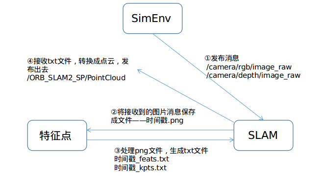

# SuperPoint_SLAM
使用SuperPoint方法提取特征点，来代替ORB-SLAM中的ORB特征。整个项目会由三个部分，分别是：

- 仿真环境**SimEnv**。主要实现仿真环境的构建、机器人及其传感器的放置、机器人与环境的交互，具有键盘控制机器人运动的功能，需要发布`/camera/rgb/`和`/camera/depth/`的相关消息。
- **SLAM模块**。基于ORB-SLAM2框架,将ORB特征全面替换为SuperPoint特征，其中为了实现建图功能，额外添加了`PointCloud.cc`，用于生成点云，然后建图。
- SuperPoint特征提取**SuperPointPretrainedNetwork**。运行其中的`demo_superpoint.py`，能够实时处理RGB图片，生成特征点文件。

### 模块间关系



为了保证时间能够对上，图中的四步能够保持一致（在特征点处理图片时，不会再有新的图片保存下来），我们设计了如下方法：

基本思想：通过往`/dev/shm/tmpSP/`中读写文件实现同步，`/dev/shm/`这个文件夹下的文件能够实现快速读写。

```c++
cv::imwrite(filename, RGB);
system("touch /dev/shm/tmpSP/ready.txt");
while( ! file_exist("/dev/shm/tmpSP/done.txt")){
    usleep(5000);
}
Camera_Pose = mpSLAM->TrackRGBD(cv_ptrRGB->image,cv_ptrD->image,cv_ptrRGB->header.stamp.toSec());
system("rm -r /dev/shm/tmpSP/*");
```

SLAM模块中先保存接收到的图片，然后创建一个`ready.txt`，用来标记图片已保存，然后会一直查找文件夹下有无`done.txt`，若查找到，才可继续运行并接收下一张图片，在接收图片前要清空文件夹。

```python
while ( not os.path.exists(listenlingfolder+'ready.txt') ):
    time.sleep(0.01)
    # print("1234")
    os.remove(listenlingfolder+'ready.txt')
    f_list = glob.glob( listenlingfolder+'/*.png' )
    assert len(f_list) == 1
    for file_i in f_list:
        if file_i.split('.')[-1] == 'png':
            print(file_i)
            targetpre = re.sub(r'\.png', "", file_i)
            print(targetpre)
            getImage2SP(file_i,targetpre,fe)
            os.remove(file_i)
            pathlib.Path(listenlingfolder + '/done.txt').touch()
            while ( os.path.exists(listenlingfolder+'/done.txt') ):
                time.sleep(0.01)
```

特征点模块中会一直查询有无`ready.txt`文件，查找到了，说明图片已存在，就可开始处理。处理前先删除`ready.txt`，除了完后会生成`kpts.txt`和`feats.txt`，同时再新建一个`done.txt`，用来告诉SLAM模块上一帧已经处理完毕，可以接收新的图片了。

### 主要问题

- **特征点数不够**，导致效果不佳。主要原因可能还是仿真环境不够逼真，仿真环境中的RGBD相机获取到的图片与实际场景的照片差距较大。解决方案：使用AirSim替换Gazebo、改变原先使用的相机。
- **各模块间的帧率不匹配**，造成仿真时较卡顿。解决方案：仿真时具体调整。
- 优化处理速度，尽可能提高帧率。